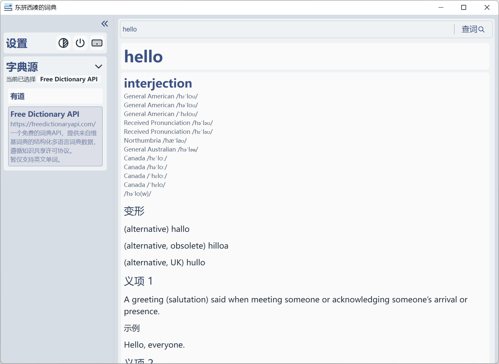

<h1>
    
    东拼西凑的词典 MixDict
</h1>

[](LICENSE.md)
[]()
[](https://www.python.org/)
[](https://pywebview.flowrl.com/)
[]()
[](https://github.com/j1y2b3/MixDict/commits/main/)

> 一个基于网络词典源和 pywebview 构建的简单网络词典 GUI 程序。

<picture>
    <source media="(prefers-color-scheme: dark)"
    srcset="assets/screenshot-dark.png" />
    <source media="(prefers-color-scheme: light)"
    srcset="assets/screenshot-light.png" />
    
</picture>

## 特性

- 快捷键唤出窗口快速查词
- 可使用各种网络词典源，包括[内置词典源](#内置词典源)和[自定义词典源](#自定义词典源)，无需 API key
- 托盘常驻，可设置开机自启，明/暗/跟随系统三态主题

## 下载 / 安装

Windows 平台

### 安装包

前往 [Release](https://github.com/j1y2b3/MixDict/releases) 页面下载。

### 从源码运行

> 从源码运行不支持开机自启。

#### 克隆仓库

```bash
git clone https://github.com/j1y2b3/MixDict.git
cd MixDict
python -m venv .venv
.venv\Scripts\activate
pip install -e .
python main.py
```

## 使用

额，基本使用你们应该都会用的吧。。

### 内置词典源

| 词典源              | 数据来源                                         | API                                                            | 说明                                                                             |
| ------------------- | ------------------------------------------------ | -------------------------------------------------------------- | -------------------------------------------------------------------------------- |
| 有道                | [有道词典](https://dict.youdao.com/)             | https://dict.youdao.com/jsonapi                                | 词典数据版权归网易有道所有，本程序仅作学习与个人使用，与有道官方无关。请勿滥用。 |
| Free Dictionary API | [English Wiktionary](https://en.wiktionary.org/) | https://freedictionaryapi.com/api/v1/entries/{language}/{word} | 暂仅支持英文单词。限 1000 次每小时每 IP。                                        |

### 自定义词典源

以 Python 文件形式放入可执行文件同目录下 `user_sources` 文件夹中，暂不支持图形界面导入。

#### 示例（ user_sources/example.py ）

```python
import logging

from mixdict import schema
from mixdict.core.sources.base import DictionarySource

logger = logging.getLogger(__name__)


class Source(DictionarySource):

    def __init__(self):
        super().__init__(reg_name="Example", name="示例", description="这是一个示例词典源")

    def _lookup(self, word: str) -> dict:
        page = schema.PageMeta(word, is_found=False)

        section = schema.SectionMeta("示例1")
        section.add_phonetic("示例发音", "示例", audio_url="https://example.com/audio.wav")
        section.add_text("示例文本1")\
               .add_text("示例文本2", font_style="stress")\
               .add_text("示例文本3", font_style="muted")
        section.add_link("示例链接", url="https://example.com/")
        page.add_section(section)

        section = schema.SectionMeta("示例2")
        page.add_section(section)

        return page.get()
```

#### 说明

嘶——，详见 `mixdict.core.sources.base.DictionarySource` 和 `mixdict.schema` 代码。

<!-- TODO
##### **class** `mixdict.core.sources.base.DictionarySource(reg_name: str, name: str, description: str = "")`

每个用户词典源必须有一个 `Source` 类， 继承自 `mixdict.core.sources.base.DictionarySource`，需实现以下方法。

###### **method** `__init__(self)`

调用 `super().__init__(self, reg_name: str, name: str, description: str = "")`。

`reg_name` 为程序内注册名，`name` 为前端显示名，可选参数 `description` 为词典源描述。

###### **method** `_lookup(self, word: str) -> dict`

实现查词逻辑，并将数据根据 [`schema`](#module-mixdictschema) 组装成交给前端显示的数据框架，并返回 `mixdict.schema.PageMeta.get()`。

`word` 为待查的词。

错误处理和显示已在 `mixdict.core.sources.base.DictionarySource` 实现。

###### **module** `mixdict.schema`

交给前端显示的数据框架。

###### **class** `mixdict.schema.PageMeta(word: str, is_found: bool, is_error: bool = False)`

查词结果页面，由一个个 `mixdict.core.sources.base.SectionMeta` 组成。

`word` 为查询的单词，`is_found` 标记是否找到，可选参数 `is_error` 标记是否出现错误。

###### **method** add_section(self, section: SectionMeta)

向查词结果页面添加一栏结果。
-->

开发时用户自定义词典源开发支持热更新。

### 命令行选项

```bash
$ python main.py --help
usage: MixDict [-h] [--version] [-d] [--hidden] [-q]

A simple network dictionary GUI program built on some network dictionary sources and pywebview.

options:
  -h, --help   show this help message and exit
  --version    show program's version number and exit
  -d, --debug  user debug mod
  --hidden     hide the window at startup
```

其中 --debug / -d 选项为用户临时调试选项，不改变用户数据储存位置和单实例锁监听端口。

## 已知问题

- 一些功能（如快捷键，开机自启等）暂不支持非 Windows 平台。
- 单实例锁会监听 127.0.0.1:50712 （开发时调试模式为 127.0.0.1:51712 ），可能会被其他应用程序占用导致无法打开，解除占用后再次打开即可。
- 快速查词快捷键有时会失效。
- 可执行文件的命令行功能没有控制台输出。
- 开发模式下触发 CSS 热更新后再触发 HTML / JavaScript 热更新会回退 CSS 的热更新，再次触发 CSS 热更新即可。

## 构建

```bash
cd MixDict
python -m venv .venv
.venv\Scripts\activate
pip install -e ".[build,dev]"
python build.py
```

构建结果在 dist/MixDict 。

## 开发

为什么会有人看这个呢？那既然来都来了，我也说一点吧。

### 环境

```bash
git clone https://github.com/j1y2b3/MixDict.git
cd MixDict
python -m venv .venv
.venv\Scripts\activate
pip install -e ".[build,dev]"
```
Web 引擎详见 [pywebview 文档](https://pywebview.flowrl.com/guide/web_engine.html)。

其余见 pyproject.toml 。

### 运行

开发模式启动：
```bash
python -X dev main.py
```

此模式下除了 Python 的默认开发模式行为，MixDict 会：

- 将 `webview.start` 的 `debug` 参数设为 `True` 。
- 支持前端界面开发（即改动 mixdict/gui/web 下的文件）热更新，但对 CSS 的热更新有些[问题](#已知问题)。
- 支持使用 `$test-error-display` 查词以预览错误页。
- 将用户数据储存在 MixDict-dev 下。
- 使单实例线程监听 127.0.0.1:51712 。
- 禁用开机自启。

## 致谢

| 项目                                                    | 用途                     | 许可证           |
| ------------------------------------------------------- | ------------------------ | ---------------- |
| [Python](https://www.python.org/)                       | 运行时                   | PSF License      |
| [pywebview](https://pywebview.flowrl.com/)              | GUI 框架（WebView 封装） | BSD-3-Clause     |
| [pystray](https://github.com/moses-palmer/pystray)      | 系统托盘                 | LGPL-3.0         |
| [Pillow](https://python-pillow.github.io)               | 图片处理（托盘图标）     | MIT-CMU          |
| [platformdirs](https://github.com/tox-dev/platformdirs) | 跨平台标准目录           | MIT              |
| [Tabler Icons](https://tabler.io/icons)                 | 界面图标                 | MIT              |
| Microsoft Edge WebView2 Runtime                         | Windows 平台界面渲染     | -                |
| [PyInstaller](https://pyinstaller.org/)                 | 构建工具                 | GPL-2.0-or-later |

> - `pystray` 以未修改的库形式使用，本程序对其源码未作任何改动。
> - `PyInstaller` 采用 GPL 许可证，但其 Bootloader Exception 允许以任意许可证分发打包产物，因此不影响本程序以 MIT 许可证发布。


### 数据来源

- [**有道词典**](https://dict.youdao.com/)：词典数据版权归网易有道所有，本程序仅作学习与个人使用，与有道官方无关。
- [**English Wiktionary**](https://en.wiktionary.org/)：经由 [freedictionaryapi.com](https://freedictionaryapi.com/) 提供，使用 [CC BY-SA 4.0](https://creativecommons.org/licenses/by-sa/4.0/) 协议。相关释义的著作权归 Wiktionary 贡献者所有。

## 许可证

使用 [MIT 许可证](LICENSE.md)。
